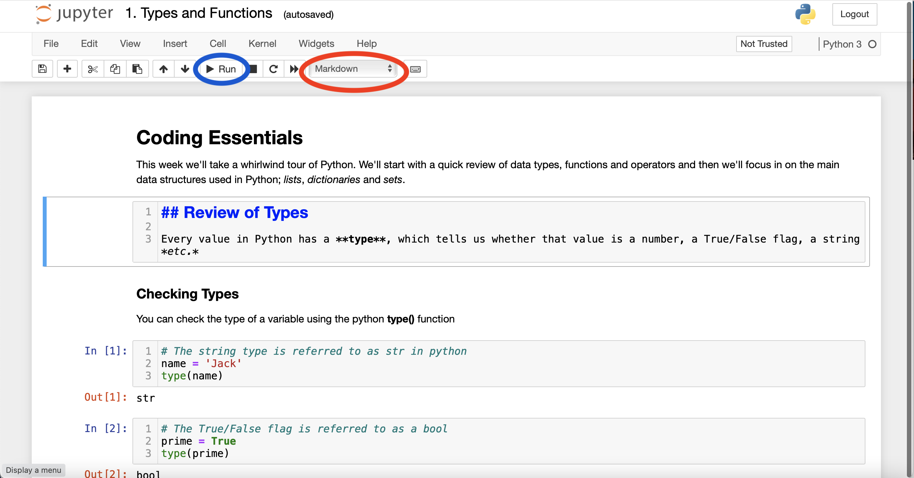

# Quick Start Instructions

The following guide will help you get a python environment up and running to try out the code in this repository

## What is Python?

Python is a general-purpose programming language which has become very popular in the fields of data science in general, and machine learning in particular. Python is a fluent, readable language with a simple syntax. The large number of packages available provide lots of out-of-the-box functionality for complex data wrangling tasks.

## Setting up the Environment

Even if you're new to data wrangling, there's a good chance you already have some version of Python installed on your machine. Because Python is so widely used, some applications already on your machine will most likely use Python and need it to be installed to function properly. This leads to one of the few undeniable pain-points when working with Python: versioning.

## Python Versions

Python is always being improved and updated, but sometimes these updates can cause issues for code written for older versions of the Python interpreter. Worse still, most machines come with two majorly different versions of Python installed side-by-side, *Python2* and *Python3*. These are less like different versions of the same language and more like two different languages altogether. Managing the different versions of Python on your machine can be a thankless and frustrating job. Never fear, though, help is at hand. Enter **anaconda**, a python environment manager for data scientists.

## Anaconda

Anaconda allows you to set up a dedicated development environment (a collection of languages, packages and settings) for python. Although Anaconda operates a paid premium service for organisations, the software is free to individuals. I highly recommend it for any budding data scientists. To begin setting up your development environment head over to [www.anaconda.com](https://www.anaconda.com) and download the **individual edition** installer for your platform (Windows/Mac/Linux).

### Installing Anaconda
When it's finished downloading, run the installer. Ensure you **uncheck** the option to add Python to your path; this has the potential to cause problems with software already installed on your computer if selecgted. Do check the option to make Python 3.X the default interpreter.

### Running Anaconda
Once installed, you can open Anaconda by searching for the app: *Anaconda Navigator (anaconda3)*. Running the app will bring you to a splash screen allowing you to load up your python environment of choice. Additional environments can be installed and launched on demand. I recommend **not installing RStudio** through anaconda. Anaconda does a great job of working with Python environments, the R environment is, at the time of writing, less stable.

## Jupyter Notebook
Jupyter notebook is a web-based Python development environment for writing beautifully presented, interactive Python code. The interactive python notebook (.ipynb) format allows Python code to be mixed with markdown for nicely formatted, shareable code. This is particularly important in data wrangling where scripts
are often quite short, but can be dense and difficult to understand without sufficient comments.

### Running an ipynb Notebook
When you launch Jupyter Notebook from Anaconda you'll be taken to a webpage in your browser showing all of the files and folders in your home directory. Clicking on a directory in your browser will open it up in Jupyter notebook. Download [1. Types and Functions](<1. Types and Functions.ipynb>) and navigate to its containing folder in Jupyter. Click on the notebook to open it.

### Markdown

The majority of the document is written markdown. Markdown is a simple markup language giving you basic formatting capabilities. It's quite intuitive and easy to learn, check out this [cheat sheet](https://github.com/adam-p/markdown-here/wiki/Markdown-Cheatsheet) for an handy guide.

### Cells

A jupyter notebook consists of *cells*. Each cell in a notebook is made up either of *markdown* (text and comments) or *code*. Double clicking a cell will open up the editing view.

A cell's type can be determined using the dropdown (circled in red, in the screenshot above). When we've finished working on a cell, we generally want to *run* it (circled in blue). When we run a markup cell, the text is rendered nicely for us. When we run a code cell, the python code is executed, and the return value of the **last line of code in the cell** is displayed in the output below the cell.

### Working with Code Cells

Code may be split across multiple cells. Any variables or functions defined in one cell may be used in another (just make sure you've actually run the cell that defined the variable or function). It's always a good idea to open up the *Cell* menu and select the option to *Run All* when you open a notebook for the first time to avoid confusion.

When you're developing a solution to a data wrangling problem you'll find yourself chopping and changing code. This can cause problems when you go to share your notebook with someone else (or submit it for an assignment). The last thing I do before wrapping up a notebook is go to the *Kernel* menu item and select *Restart and Run All*. This clears everything and makes sure the notebook will run without errors if you share it.

## Using this Guide
This repository contains a number of notebooks explaining the basic concepts of Python. You can read through the notebooks for a brief overview of the most important concepts. However, programming is a fundamentally practical discipline, and there's no substitute for learning by doing. Jupyter notebooks are interactive, so feel free to mess around the notebooks, get your hands dirty, and don't be afraid to break things. Breaking things is the best way to learn, and you can always grab a fresh copy of the file from here if things get out of control!

## Exporting Notebooks

Notebooks can be exported as raw python files (useful if you'd like to be able to run your script easily from the command line). Open the *File* menu and select *Download as...* -> *Python*.

We can also export the document as a .pdf or .html file. HTML files are handy if you'd like to host your beautiful work online. PDFs can be useful for creating reports *etc.* Note that in order to export to pdf you'll need to have Latex installed on your computer. If you're going to do this, I recommend installing the MikTex distribution, as this will kill two birds with the one stone and let you export your R Markdown notebooks to pdf as well. See [miktex.org](https://miktex.org) for details on how to install Latex. 

